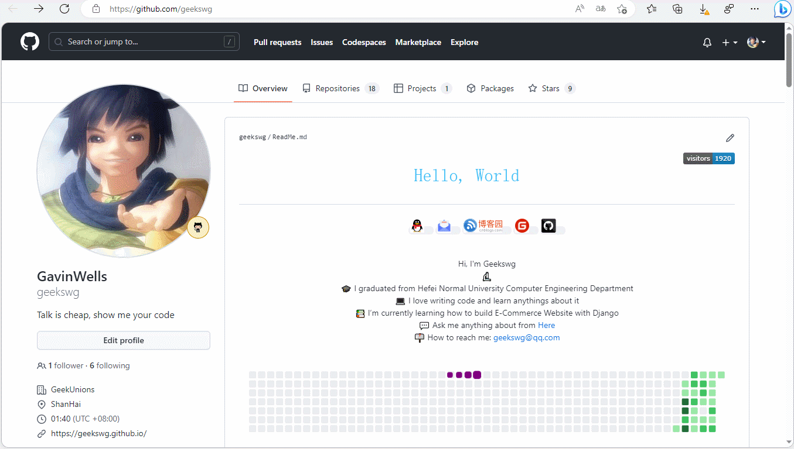

# 日常笔记


记录日常笔记，随手记录一些流水账。
倒叙记录。

<!--more-->
## Github网页小技巧

> github 网页快捷键 `.` 和 `?`
> [Github](https://github.com/)和[VSCode](https://vscode.dev/)在梦幻线联动，非常惊喜。

### `.`快捷键

> 快速在vscode-for-web中打开当前仓库代码


在 `github`的仓库地址页面 按下键盘上的**.**按键会自动跳转到在线vscode编辑上，可直接编辑你的仓库代码。
直呼niubility，非常方便快捷，赶紧用起来吧。



要有 **科学上网的环境** ,不然vscode 显示有点问题，不能浏览仓库内容。


### `/`快捷键快速搜索

在github web页面上,按快捷键`/`可快速在github搜索。

---

> 作者: [geekswg](https://geekswg.github.io)  
> URL: https://geekswg.github.io/daily-notes/  

