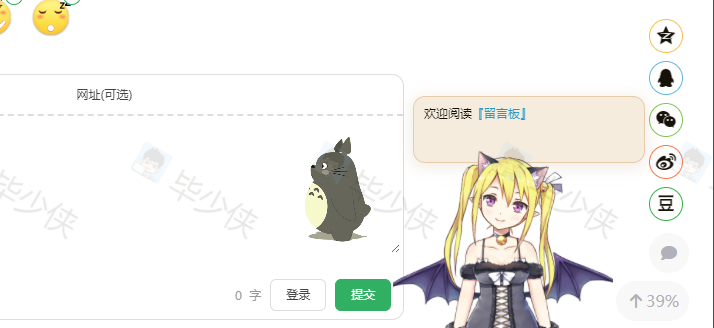

# Hugo Shortcode Plugins Live2d


记录一次Hugo主题ShortCode插件集成过程和Shorcode插件的食用方法。 
感谢Fixit主题作者提供方法和指导帮助。
note abstract info tip success question warning failure danger bug example quote


<!--more-->
## 预览
hugo live2d版娘插件
[Github地址](https://github.com/fixit-theme/hugo-shortcode-plugins-live2d) 
https://github.com/fixit-theme/hugo-shortcode-plugins-live2d

> 预览效果

## 前置条件

> 前提要了解Hugo框架的大致目录结构，已经每个目录是个干什么的有什么作用，尽量按照Hugo官方目录结构放置对应类型文件，因为Hugo有很多约定的东西。
> 如果不太熟悉Hugo的架构，尽量不要改动目录结构，或者自定义目录。
官方文档地址：https://gohugo.io/overview/getting-started/shortcodes/#shortcodes
> 使用到的语言 `Hugo 模板语言`，`js`，`html`,`css`  
## 集成思路
首先，简单说明下为什么要单独做一个插件出来使用？
* 方便使用，学习成本低。
* 代码入侵低，即插即用，随用随走。
* 可以按需加载。

开始思考如何实现，主要参考：

## 开始集成

* 在themes 目录新建一个文件夹，名字为`your-plugins-name`。
* 根据插件的实现，添加相应的文件目录。
* 根据功能需求配置添加相应的参数，完成参数的加载传递和插件集成，主要用到的是传统html+js模式。
* 

## 插件食用

## 注意事项

---

> 作者: [geekswg](https://geekswg.github.io)  
> URL: https://geekswg.github.io/hugo-shortcode-plugins-live2d/  

