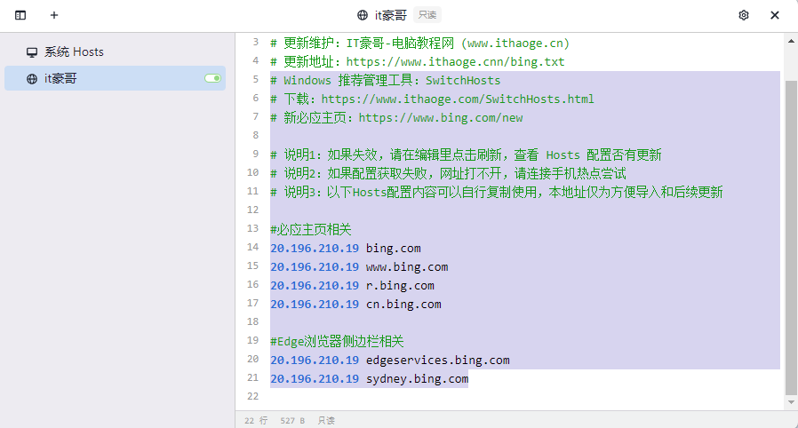
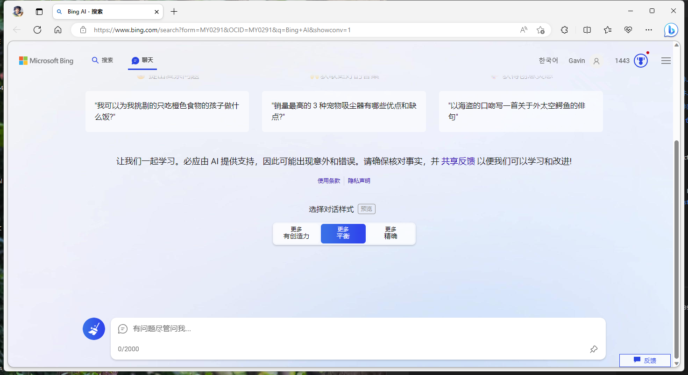

# New Bing 国内正常访问方法


记录国内正常网络环境直接访问New Bing的方法。
之前的插件方法已经失效
截止目前以下方法可正常访问，使用 [SwitchHosts](https://github.com/oldj/SwitchHosts) 插件
note abstract info tip success question warning failure danger bug example quote


## 前言
最近百度文心一言发布了，还在内测申请，[申请地址](https://yiyan.baidu.com/welcome),不知道个人需要多长时间可以通过申请。
最近的AI搜索引擎比较火，我之前申请的new bing体验了，还是比较厉害的，现在又升级了，对话限制提高到了15次对了。不过国内的网络不能直接访问bing.com/new,这一点比较难受，今天在晚上看到一个工具可以解决，国内直接访问new bing的方法。

前提你已经通过new bing 的waitlist，不然你还是用不上new bing哟！

<!--more-->
## 方法

> 使用 [SwitchHosts](https://github.com/oldj/SwitchHosts)
SwitchHosts 是一个管理、切换多个 hosts 方案的工具。 它是一个免费开源软件，支持 Windows、Mac、Linux 三大桌面操作系统。
* 快速切换 Hosts 方案
* Hosts 语法高亮
* 支持从网络加载远程 Hosts 配置
* 可从系统菜单栏图标快速切换 Hosts


下载后 注意使用 **管理员身份运行**
新增-本地-确定，然后在右边输入以下配置hosts方案
操作如下图





```hosts
# Windows 推荐管理工具：SwitchHosts
# 下载：https://www.ithaoge.com/SwitchHosts.html
# 新必应主页：https://www.bing.com/new

# 说明1：如果失效，请在编辑里点击刷新，查看 Hosts 配置否有更新
# 说明2：如果配置获取失败，网址打不开，请连接手机热点尝试
# 说明3：以下Hosts配置内容可以自行复制使用，本地址仅为方便导入和后续更新

#必应主页相关
20.196.210.19 bing.com
20.196.210.19 www.bing.com 
20.196.210.19 r.bing.com
20.196.210.19 cn.bing.com

#Edge浏览器侧边栏相关
20.196.210.19 edgeservices.bing.com
20.196.210.19 sydney.bing.com
```

## 预览
接下来就可以正常在浏览器输入 https://www.bing.com/new
就能愉快的和new bing玩耍了。




---

> 作者: [geekswg](https://geekswg.github.io)  
> URL: https://geekswg.github.io/new-bing-visit/  

