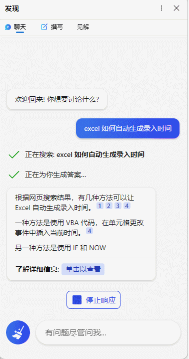
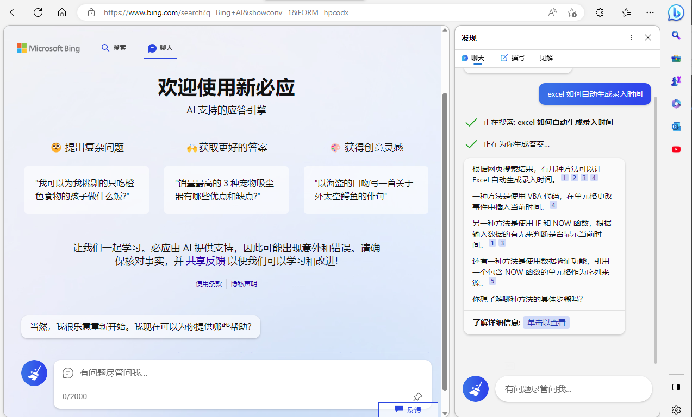

# New Bing 申请教程


note abstract info tip success question warning failure danger bug example quote

这里使用MD语法编写你的文章
<!--more-->

## 申请New Bing

## 老账户无法加入waitlist

老的微软账户是不是提示



1. 使用科学上网地址非国内地址，申请一个新的微软账户加入 new bing [waitlist](https://www.bing.com/new)
2. 继续使用老账户申请
> 如果在申请 new bing waitlist 等候名单遇到 错误提示信息

1. 出错了，请重试
2. Something went wrong, please try again later.

原因就是 Microsoft rewards 已经在国内使用过了，被禁用了。

真正的解决方案：
最终跟专家确认，new bing 的体验确实受 Microsoft rewards 影响，但是清理全部 rewards 没什么用，可以通过：rewards.bing.com/optout 退出rewards计划，之后再通过：rewards.bing.com/加入rewards； 之后再点击加入waitling list 候补就可以了。


## New Bing 上手体验

> 使用体验非常好，尤其是上下文语境做的让人非常舒服，总之是一个合格而且优秀的助手
推荐下载 [Edge-Dev](https://www.microsoftedgeinsider.com/zh-cn/download/dev) 体验效果非常好

> 网页中使用bing-chat

https://www.bing.com/search?q=Bing+AI&showconv=1&FORM=hpcodx

---

> 作者: [geekswg](https://geekswg.github.io)  
> URL: https://geekswg.github.io/new-bing/  

