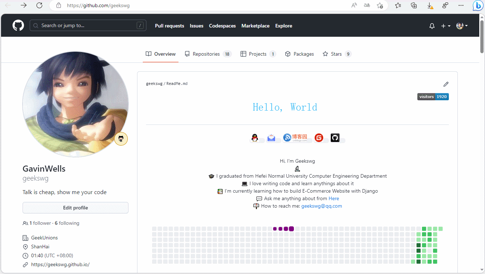

# 日常笔记


    记录日常笔记和分享一些有趣的发现，随手记录一些流水账，好记性不如烂笔头。
倒叙记录。

<!--more-->
## title

### ⏱️2023/03/00 00:00

## itab-新标签页浏览器插件

iTab 新标签页iTab新标签页，小组件，起始页，标签页，日历，股票，浏览器扩展
免费无广告的组件式浏览器桌面

### ⏱️2023/03/07 13:48

> [传送地址](https://itab.link/) 
支持大部分主流浏览器，作者更新比较及时，经常推出一些好玩的组件。

## uTools工具箱

> 一款PC端的工具箱合计，类似在线工具网站的类似功能聚合。使用起来比较方便，可以极大提升效率。

### ⏱️2023/03/05 22:16

新一代效率工具平台,自由组合插件应用，打造专属你的趁手工具集
[uTools官网](https://u.tools/ "效率工具")

## git clone报错

### ⏱️2023/03/04 00:16


Cloning into 'blogFixit'...
fatal: unable to access 'https://github.com/geekswg/blogFixit.git/': SSL certificate problem: unable to get local issuer certificate


> 解决方法：
打开git命令操作框，配置http.sslVerify为false,如下：
`git config --global http.sslVerify false`


2023-03-05 01:41:52.782 [info] Author identity unknown
*** Please tell me who you are.
Run
  git config --global user.email "you@example.com"
  git config --global user.name "Your Name"
to set your account's default identity.
Omit --global to set the identity only in this repository.


## 发现一个宝藏网站

### ⏱️2023/03/02 00:16

> 两个个有趣的在线工具网站，很有意思，虽然是英文的。
在线工具网站： 
1. http://patorjk.com/blog/software/
2. https://id.tool.lu

## notion超好用的笔记软件

> Notion 是一款国外的知识管理软件，以高颜值、无广告、简洁的系统界面著称。它将笔记、知识库、任务待办（to-do list)、日历、项目管理等功能集于一身。你可以在桌面或网页上使用 Notion。

### ⏱️2023/03/01 21:11

软件地址 https://www.notion.so/

## 免费加速器-AK加速器

始终相信没有永远免费的加速器，永远有免费的加速器。

别用NN加速器，有毒，流氓软件！！！


### ⏱️2023/02/28 15:16

> AK加速器 每天分数段免费，目前免费时间每天【00:00 ~ 14:00】

亲测目前可用的免费加速器，感觉比较良心了，传送门 [AK加速器](https://www.akspeedy.com/)

## Github网页小技巧

> github 网页快捷键 `.` 和 `?`
> [Github](https://github.com/)和[VSCode](https://vscode.dev/)在梦幻线联动，非常惊喜。

### `.`快捷键

> 快速在vscode-for-web中打开当前仓库代码


在 `github`的仓库地址页面 按下键盘上的**.**按键会自动跳转到在线vscode编辑上，可直接编辑你的仓库代码。
直呼niubility，非常方便快捷，赶紧用起来吧。



要有 **科学上网的环境** ,不然vscode 显示有点问题，不能浏览仓库内容。


### `/`快捷键快速搜索

在github web页面上,按快捷键`/`可快速在github搜索。

---

> 作者: [geekswg](https://geekswg.github.io)  
> URL: https://geekswg.github.io/posts/2023/daily-notes/  

