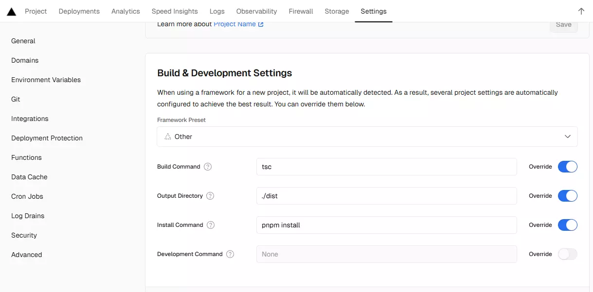
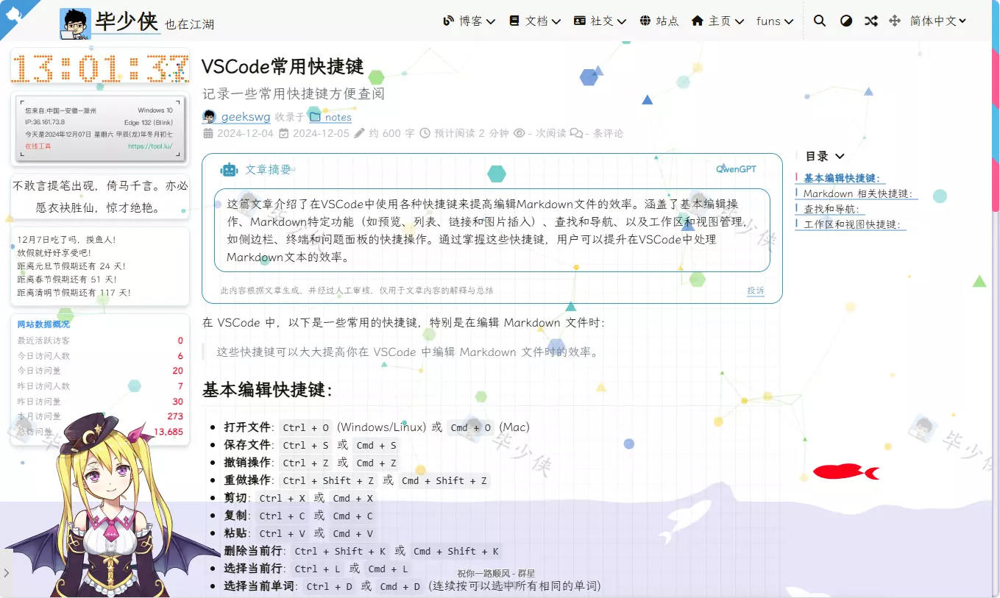

# 给你的网站添加AI摘要功能


## 功能实现

主要是获取当前网站文章内容，然后通过Cloudflare Workers调用qwen1.5-14b-chat-awq模型生成摘要，最后将摘要显示在网站中。
网上找到一个`FloatSheep`大佬编写的项目[FloatSheep/Qwen-Post-Summary](https://github.com/FloatSheep/Qwen-Post-Summary/)正好可以满足我的需求，于是我就直接使用了。
## 后端部署

### Cloudflare Workers部署千问模型
在[Cloudflare控制台](https://dash.cloudflare.com/)，选择`Workers 和Pages`，依次点击`创建`、从模板分类`AI`、`LLM APP`，输入你的项目名称，点击`部署`后，复制[worker.js](https://github.com/FloatSheep/Qwen-Post-Summary/blob/vercel/worker/worker.js),粘贴到刚刚创建`index。js`中，然后点击`部署`。如果[预览页面](https://qw.geekswg.workers.dev/)显示出`Method Not Allowed`，表示已经部署成功。

到此已经已利用Cloudflare Workers部署好了后端，但是这样每次获取AI摘要都需要调用Cloudflare Workers的通义千问 14B 模型，这样会消耗Cloudflare Workers的流量和AI接口次数，而且访问体验不佳，我们可以利用Vercel作为一个中间件，利用KV存储来缓存摘要，这样就可以减少Cloudflare Workers的流量和AI接口次数，而且访问体验也会更好。
去部署[Vercel中间服务](https://vercel.com/new/clone?repository-url=https%3A%2F%2Fgithub.com%2FFloatSheep%2FQwen-Post-Summary%2Ftree%2Fvercel&env=SUMMARY_API%2CPROXY_ENABLE&envDescription=SUMMARY_API%20%E4%B8%BA%20Cloudflare%20Worker%20%E6%89%80%E7%BB%99%E5%87%BA%E7%9A%84%E5%9F%9F%E5%90%8D%EF%BC%8CPROXY_ENABLE%20%E8%AF%B7%E5%A1%AB%E5%86%99%20false&output-directory=.%2Fdist)
其中`SUMMARY_API`为刚刚CloudFlare Workers部署成功地址，`PROXY_ENABLE`为是否启用代理，填`false`即可。

### vercel部署项目配置
`Settings`、`Build & Development Settings` 配置如下
 

||Key | value |
|| ------ | ----------- |
||Build Command    | tsc |
||Output Directory | ./dist |
||Install Command  | pnpm install |

### 配置Storage
`Storage`、`Creatre Database`、`Upstash`、`Upstash KV`、然后一路保存即可。
### 重新部署Vercel项目
`Deployments`、`Redeploy`、重新部署项目。

后端接口预览地址：[https://qw.geekswg.top/](https://qw.geekswg.top/)

> [!IMPORTANT]
> 由于Vecel自带域名国内无法正常访问，所以需要将自己域名解析到Vecel的域名上，点击Domains添加自定义域名即可。  

接下来就是前端调用后端接口获取摘要了。
## 前端使用
前端页面使用[ai-summary.js](http://geekswg.js.cool/js/ai-summary.js) 调用后端接口获取摘要，并显示在页面中，理论上可以在任何html页面中应用该代码使用ai摘要功能。
例代码如下
```js
<script src="/js/ai-summary.js" ></script>
<script>
  //ai摘要接口地址 项目 
  aiConfig.aiApi = "https://qw.geekswg.top"
  //需要ai摘要的页面内容的选择器
  aiConfig.aiSelector = '#content';
  //投诉链接
  aiConfig.reportUrl = "mailto:geekswg@qq.cn?subject=文章摘要投诉&body=投诉网址：="+location.href;
  //正则表达式启用ai摘要的路径
  aiConfig.enableAIPathRegex = /^\/(posts|mydocs)\//; 
  aiConfig.aiGPTDesc = '我是一个基于通义千问大语言模型（LLM）的AI摘要工具，它可以帮助你快速生成文章摘要，提高阅读体验。';
  document.addEventListener("DOMContentLoaded", () => {
    AISmmary.init(aiConfig);
  });
</script>
```
> [!NOTICE] 说明
> 以上js代码主要来自`FloatSheep`的项目[FloatSheep/Qwen-Post-Summary](https://github.com/FloatSheep/Qwen-Post-Summary/),稍作修改调整
> 其中 aiConfig.aiSelector 可以在浏览器中按`F12`然后`Ctrl+Shift+C`，点击你需要生成内容摘要的页面元素，然后`复制`->`复制Selector`，例`#content`。

## 预览效果



## 参考文章
本文参考了以下文章 

https://blog.hesiy.cn/posts/qwen-summary/

https://mabbs.github.io/2024/07/03/ai-summary.html

---

> 作者: [geekswg](https://github.com/geekswg)  
> URL: https://geekswg.js.cool/posts/2024/ai-summary/  

